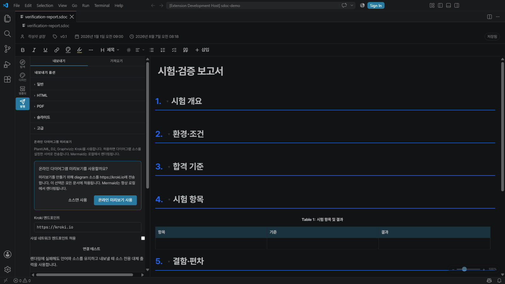
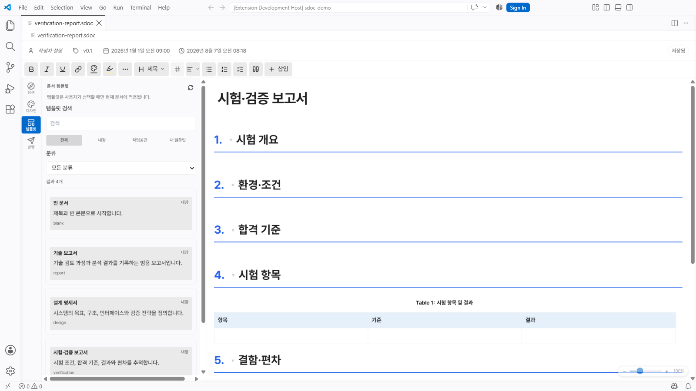

<p align="center">
  
</p>

<h1 align="center">Structured Doc Editor</h1>

<p align="center">
  VS Code에서는 WYSIWYG로 작성하고, CLI에서는 안전하게 자동화하세요.<br>
  원본은 Git으로 검토 가능한 구조화 JSON으로 남습니다.
</p>

<p align="center">
  <a href="https://marketplace.visualstudio.com/items?itemName=swbaek.structured-doc-editor"></a>
  <a href="https://www.npmjs.com/package/sdoc-editor-cli"></a>
  <a href="https://github.com/SWBaek/sdoc-editor/actions/workflows/ci.yml"></a>
  <a href="https://github.com/SWBaek/sdoc-editor/blob/main/LICENSE"></a>
</p>

<p align="center">
  <a href="https://marketplace.visualstudio.com/items?itemName=swbaek.structured-doc-editor">VS Code에 설치</a>
  · <a href="https://www.npmjs.com/package/sdoc-editor-cli">npm CLI</a>
  · <a href="#빠른-시작">빠른 시작</a>
  · <a href="#프로젝트-문서">문서</a>
</p>

<p align="center">
  
</p>

Structured Doc Editor는 `.sdoc`와 레거시 `.tiptap.json` 문서를 위한 오픈 소스 기술 문서 편집기입니다. 제목·표·수식·다이어그램·캡션·교차 참조를 문서 화면에서 편집하면서, 사람이 검토하고 Git으로 추적하기 쉬운 원본을 유지합니다.

VS Code 확장과 SDOC CLI는 같은 문서 계약을 사용합니다. VS Code는 시각 편집과 import/export를, CLI는 자동 검사와 revision-safe 의미 연산을 담당합니다.

## 빠른 시작

| 공식 배포면 | 이런 경우에 적합합니다 | 요구 사항 |
|---|---|---|
| [**VS Code 확장**](https://marketplace.visualstudio.com/items?itemName=swbaek.structured-doc-editor) | 코드와 기술 문서를 같은 workspace에서 시각적으로 작성 | VS Code 1.85 이상 |
| [**SDOC CLI**](https://www.npmjs.com/package/sdoc-editor-cli) | AI·스크립트·CI에서 문서를 생성하고 검사·변경 | Node.js 22.22.2 이상 |

### VS Code

1. [Visual Studio Marketplace](https://marketplace.visualstudio.com/items?itemName=swbaek.structured-doc-editor)에서 확장을 설치합니다.
2. 명령 팔레트에서 `Structured Doc: New .sdoc Document (Experimental Templates)`를 실행하거나 기존 `.sdoc`/`.tiptap.json`을 엽니다.
3. 문서를 편집하고 `Ctrl+S`로 저장합니다.

명령줄로 설치하려면 다음을 실행합니다.

```bash
code --install-extension swbaek.structured-doc-editor
```

Marketplace가 공식 설치 경로입니다. 직접 빌드한 `.vsix`는 명령 팔레트의 `Extensions: Install from VSIX...`에서 설치할 수 있습니다.

### SDOC CLI — npm 공식 배포

SDOC CLI는 npm Registry의 공식 공개 패키지입니다. 먼저 프로젝트를 변경하지 않고 최신 버전을 실행해 볼 수 있습니다.

```bash
npx sdoc-editor-cli@latest --help
```

프로젝트에서 반복해서 사용하거나 버전을 고정하려면 개발 의존성으로 설치합니다.

```bash
npm install --save-dev sdoc-editor-cli
npx sdoc-editor-cli --version
npx sdoc-editor-cli capabilities --json
```

설치된 프로젝트를 npm의 최신 안정 버전으로 업데이트할 수 있습니다.

```bash
npm install --save-dev sdoc-editor-cli@latest
```

> [!IMPORTANT]
> 공식 패키지 이름은 `sdoc-editor-cli`, 설치 후 실행 파일 이름은 `sdoc`입니다. `npx`에는 항상 공식 패키지명인 `sdoc-editor-cli`을 사용하세요. npm Registry의 별도 `sdoc` 패키지는 이 프로젝트와 관련이 없습니다. CLI는 스스로 업데이트하지 않으며, 업데이트는 위 npm 명령으로 명시적으로 수행합니다.

반복 가능한 CI와 AI 자동화에서는 dependency와 lockfile을 커밋하고 npm script로 실행할 수 있습니다. 전체 설치 방식, 명령, machine response 계약, semantic read, operation, 진단과 종료 코드는 [CLI 매뉴얼](cli/README.md)에서 확인하세요. 이 영문 매뉴얼은 npm 패키지 페이지에도 함께 게시됩니다.

## 왜 Structured Doc Editor인가

- **구조를 보며 편집합니다.** H1–H6 제목, 표와 그림, KaTeX 수식, 코드, 다이어그램과 콜아웃을 WYSIWYG로 다룹니다.
- **Git으로 검토할 수 있습니다.** `.sdoc`은 버전이 지정된 portable JSON이며 공개 [JSON Schema](sdoc.schema.json)로 검증할 수 있습니다.
- **참조가 문서와 함께 움직입니다.** 제목·그림·표의 안정적인 ID, 자동 번호와 교차 참조를 동기화합니다.
- **하나의 원본을 여러 형식으로 사용합니다.** Markdown·HTML을 가져오고 HTML·PDF·Markdown·AsciiDoc·reveal.js로 내보냅니다.
- **사람과 자동화가 같은 계약을 사용합니다.** 에디터와 CLI가 같은 schema, template과 문서 의미를 공유합니다.
- **원본 보호를 우선합니다.** 잘못된 입력, stale revision과 문서 밖 asset 경로를 조용히 덮어쓰지 않습니다.

제품이 해결하려는 문제와 장기 원칙은 [제품 비전](PRODUCT.md)에서 확인할 수 있습니다.

## 핵심 기능

| 영역 | 제공 기능 |
|---|---|
| 구조화 편집 | H1–H6, 자동 번호, 섹션 접기, 목차, 그림·표 목록, 문서 메타데이터 |
| 기술 콘텐츠 | 병합 셀 표, 이미지와 캡션, KaTeX 수식, 코드 블록, Mermaid·PlantUML·D2·Graphviz, Draw.io |
| 문서 연결 | 제목·그림·표·수식 교차 참조, 안정적인 ID, 참조 번호 자동 동기화 |
| 편집 경험 | 탐색·디자인·템플릿·배포 허브, 커서 이동 기록, 60–200% 확대/축소, 문서별 테마·폰트·사용자 CSS |
| 재사용과 출판 | 팀·개인 template, `.sdocbook`, Markdown·HTML import, HTML·PDF·Markdown·AsciiDoc·Slides export |
| 자동화 | 문서 생성·검사·검증, bounded semantic read, preview-first 의미 연산, versioned JSON response |

### 배포면별 지원

| 작업 | VS Code | CLI |
|---|:---:|:---:|
| `.sdoc` / `.tiptap.json` 사용 | 시각 편집 | 검사·검증·변경 |
| 내장·파일 template에서 문서 생성 | ✓ | ✓ |
| Markdown·HTML 가져오기 | ✓ | — |
| HTML·Markdown·AsciiDoc·PDF·Slides 내보내기 | ✓ | — |
| `.sdocbook` 편집·진단·통합 export | ✓ | — |
| revision-bound semantic read와 operation | — | ✓ |

편집기에서 `@`를 입력하면 제목·그림·표·수식 참조를 삽입할 수 있고, 클립보드 이미지는 붙여 넣은 뒤 캡션과 정렬을 지정할 수 있습니다. Mermaid는 로컬에서 렌더링합니다. PlantUML·D2·Graphviz 온라인 미리보기는 전송할 원문과 endpoint를 알리고 동의를 받은 뒤에만 사용합니다. Draw.io 편집에는 [Draw.io Integration](https://marketplace.visualstudio.com/items?itemName=hediet.vscode-drawio)이 필요합니다.

## `.sdoc` 형식과 데이터 안전성

`.sdoc`은 문서 메타데이터와 Tiptap JSON 트리를 버전이 지정된 envelope에 저장합니다.

```json
{
  "sdoc": "1.0",
  "meta": { "title": "시스템 설계서", "version": "1.0" },
  "doc": {
    "type": "doc",
    "content": [{ "type": "paragraph" }]
  }
}
```

저장 형식의 기준은 [`sdoc.schema.json`](sdoc.schema.json)입니다.

- 잘못된 JSON이나 지원하지 않는 미래 버전은 편집 가능한 빈 문서로 바꾸지 않고 진단과 원본 JSON 열기만 제공합니다.
- 저장은 문서 identity와 exact revision을 확인하며, 외부 변경과 충돌하면 로컬 초안을 보존하고 쓰기를 차단합니다.
- CLI 변경은 기본적으로 preview입니다. `--write`와 정확한 revision을 함께 요구하고 lock·재검증·원자적 교체를 거칩니다.
- 이미지와 Draw.io 파일은 portable 상대 경로만 저장하며 문서 경계 밖 경로와 symlink 탈출을 거부합니다.
- 문서와 import는 32 MiB, 개별 asset은 32 MiB로 제한합니다. 자체 포함 export는 최대 1,024개 asset 참조와 256 MiB의 고유 asset을 처리합니다.
- 전체 자체 포함 HTML/PDF에 필요한 KaTeX·Mermaid runtime과 글꼴은 확장에 포함되어 CDN 연결 없이 동작합니다.

## 템플릿과 여러 문서

> [!IMPORTANT]
> 템플릿은 아직 실험적 기능입니다. 형식과 사용자 흐름이 변경될 수 있으므로 중요한 사용자 템플릿은 Git 등으로 별도 관리하세요.

<p align="center">
  
</p>

- 빈 문서, 기술 보고서, 설계 명세서, 시험·검증 보고서 template을 내장합니다.
- 팀 template은 workspace의 `.sdoc/templates/*.sdoc`에 두고 Git으로 공유합니다.
- 개인 template은 `~/.sdoc/templates/`에 저장됩니다. Remote·WSL·SSH에서는 원격 사용자 홈에 별도로 저장됩니다.
- template 적용은 현재 본문과 문서 설정을 교체하기 전에 확인을 받으며, 이미지·Draw.io asset을 포함한 잘못된 경로 연결은 거부합니다.
- `.sdocbook`은 여러 `.sdoc`의 순서와 책 메타데이터를 관리하고 하나의 HTML/PDF로 내보냅니다. Book 편집·진단·통합 export는 현재 VS Code 전용입니다.

## 프로젝트 문서

- [제품 비전과 범위](PRODUCT.md)
- [CLI 설치와 전체 명령 계약](cli/README.md)
- [문서 JSON Schema](sdoc.schema.json)
- [기여 가이드](CONTRIBUTING.md)
- [아키텍처와 의존성 규칙](docs/architecture.md)
- [보안 취약점 신고](SECURITY.md)
- [행동 규칙](CODE_OF_CONDUCT.md)
- [자산과 라이선스 범위](ASSETS.md)

## 지원 정책과 알아둘 점

- 공식 배포면은 [VS Code Marketplace](https://marketplace.visualstudio.com/items?itemName=swbaek.structured-doc-editor)와 [npm의 `sdoc-editor-cli`](https://www.npmjs.com/package/sdoc-editor-cli)입니다. [GitHub Releases](https://github.com/SWBaek/sdoc-editor/releases/latest)는 버전이 고정된 CLI tgz를 제공하며, VSIX 공개 배포는 Marketplace를 사용합니다.
- UI 언어와 외부 renderer 같은 host 설정은 사용자 환경에, 제목·캡션·폰트·색상·테마·슬라이드 설정은 `.sdoc`의 `meta.settings`에 저장됩니다.
- VS Code는 확장을 제거해도 `settings.json`을 자동 삭제하지 않습니다. v0.7.4 이하 설정이 남아 있으면 명령 팔레트에서 `Structured Doc Editor: Clean Up Legacy Settings`를 실행하세요.
- Windows Desktop은 **v0.7.8을 마지막으로 지원이 종료(EOL)** 됐습니다. [v0.7.8 릴리스](https://github.com/SWBaek/sdoc-editor/releases/tag/v0.7.8)의 바이너리는 기록 보존용이며 보안 수정이나 호환성 지원을 받지 않습니다. 기존 `.sdoc`과 `~/.sdoc/templates/` 데이터는 백업한 뒤 현재 VS Code 확장에서 사용할 수 있습니다.

## 기여하기

버그 제보와 기능 제안은 [GitHub Issues](https://github.com/SWBaek/sdoc-editor/issues)에 남겨 주세요. 코드 기여 전에는 [CONTRIBUTING.md](CONTRIBUTING.md)의 개발 환경, 아키텍처 경계와 검증 절차를 확인해 주세요. 보안 취약점은 공개 이슈로 올리지 말고 [SECURITY.md](SECURITY.md)의 비공개 절차를 사용합니다.

AI 에이전트가 이슈를 생성하거나 수정할 때는 [AI 에이전트용 이슈 작성 가이드](.github/AI_ISSUE_REPORTING.md)와 해당 Issue Form을 따라야 합니다.

## 라이선스

소스 코드와 프로젝트 문서는 [MIT License](LICENSE)로 배포됩니다. 제3자 의존성과 별도 자산 범위는 [THIRD_PARTY_NOTICES.md](THIRD_PARTY_NOTICES.md)와 [ASSETS.md](ASSETS.md)를 확인해 주세요.
