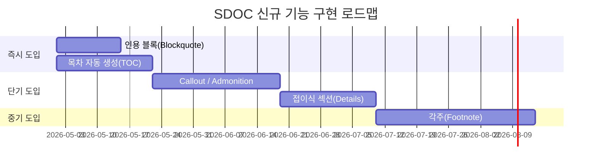

# 개요 {#개요}

## 보고서 목적 {#보고서-목적}

본 보고서는 **Structured Document(.sdoc/.tiptap.json)** 포맷의 현재 기능을 체계적으로 분석하고, 사용자 경험(UX) 관점에서 추가되면 유용한 **5가지 신규 기능**을 제안하는 것을 목적으로 합니다. 각 제안 기능에 대해 필요성, 기대 효과, 구현 방안 및 예상 JSON 스키마를 포함합니다.

## 분석 범위 {#분석-범위}

- SDOC 스키마 v1.0 기준 전체 노드 타입 및 마크 분석
- Notion, Confluence, Google Docs 등 주요 문서 도구와의 기능 비교
- 기술 문서, 회의록, 보고서 등 실무 사용 시나리오 기반 평가

# 현재 기능 분석 {#현재-기능-분석}

SDOC v1.0은 Tiptap/ProseMirror 기반의 구조화된 문서 포맷으로, 아래와 같이 **15개 카테고리**의 기능을 지원합니다.

**Table 1: SDOC v1.0 현재 지원 기능 목록**

| 카테고리 | 지원 기능 | 비고 |
| --- | --- | --- |
| 문서 구조 | Envelope(sdoc, meta, doc), H1~H6 헤딩, 자동 번호 매기기 | CSS counter 기반 자동 번호 |
| 텍스트 서식 | Bold, Italic, Underline, Strike, Code, Subscript, Superscript | 복합 마크 조합 가능 |
| 텍스트 스타일 | 글자 색상(textStyle), 배경 하이라이트(highlight) | HEX 색상 코드 지원 |
| 목록 | Bullet List, Ordered List, Task List(체크박스) | 중첩 지원 |
| 테이블 | 캡션, 셀 병합(colspan/rowspan), 열 너비, 자동 번호 | table-N 형식 ID 자동 부여 |
| 이미지 | 캡션, 정렬, alt 텍스트, 자동 번호(figure-N) | 상대 경로 참조 |
| 수식 | 인라인 수식(mathInline), 블록 수식(mathBlock) | KaTeX 렌더링 |
| 코드 블록 | 100+ 언어 구문 강조 | lowlight/highlight.js 기반 |
| 다이어그램 | Mermaid, PlantUML, D2, Graphviz 등 | 에디터 내 시각 렌더링 |
| 링크/참조 | 외부 URL, 내부 교차 참조(#id) | 헤딩/표/그림 참조 가능 |
| 텍스트 정렬 | 좌측, 중앙, 우측, 양쪽 정렬 | heading, paragraph에 적용 |
| 기타 | Hard Break, Markdown Import | YAML frontmatter 자동 스킵 |


## 현재 강점 {#현재-강점}

1. **풍부한 기술 문서 지원** — 수식, 다이어그램, 코드 블록 등 기술 문서 작성에 필요한 핵심 기능을 모두 갖추고 있습니다.
2. **정형화된 JSON 구조** — 일관된 envelope 구조와 노드 체계로 프로그래밍적 처리와 AI 연동이 용이합니다.
3. **자동 번호 체계** — 헤딩, 표, 그림에 대한 자동 번호 부여로 문서 관리가 편리합니다.

## Gap 분석 {#gap-분석}

Notion, Confluence, Google Docs 등 주요 문서 편집 도구와 비교했을 때, 아래 기능들이 부재합니다.

**Table 2: 주요 문서 도구 기능 비교**

| 기능 | Notion | Confluence | Google Docs | SDOC |
| --- | --- | --- | --- | --- |
| Callout/Admonition | ✅ | ✅ | ❌ | **❌** |
| 목차(TOC) | ✅ | ✅ | ✅ | **❌** |
| 각주(Footnote) | ❌ | ❌ | ✅ | **❌** |
| 인용 블록(Blockquote) | ✅ | ✅ | ✅ | **❌** |
| 접이식 섹션(Toggle) | ✅ | ✅ | ❌ | **❌** |


# 신규 기능 제안 {#신규-기능-제안}

## Callout / Admonition 블록 {#callout-admonition-블록}

### 필요성 {#필요성}

기술 문서에서 <span style="color:#e65100">주의사항(Warning)</span>, <span style="color:#1565c0">정보(Info)</span>, <span style="color:#2e7d32">팁(Tip)</span>, <span style="color:#c62828">위험(Danger)</span> 등 시각적으로 강조된 블록은 독자의 주의를 환기하는 핵심 요소입니다. GitHub Markdown의 `> [!NOTE]`, Notion의 Callout, Confluence의 Panel 등 거의 모든 현대적 문서 도구가 이 기능을 제공합니다.

### 기대 효과 {#기대-효과}

- 중요 정보의 시각적 구분으로 문서 가독성 대폭 향상
- 경고/주의사항 누락 방지 → 안전 관련 문서 품질 향상
- Markdown 변환 시 GitHub Alerts 문법과 자연스러운 매핑 가능

### 예상 JSON 스키마 {#예상-json-스키마}

```json
{
  "type": "callout",
  "attrs": {
    "variant": "warning",  // "info" | "tip" | "warning" | "danger" | "note"
    "icon": "⚠️"           // 선택적 커스텀 아이콘
  },
  "content": [
    {
      "type": "paragraph",
      "content": [{ "type": "text", "text": "이 작업은 되돌릴 수 없습니다." }]
    }
  ]
}
```

### 사용 시나리오 {#사용-시나리오}

**Table 1: Callout 유형별 사용 시나리오**

| 유형 | 용도 | 예시 |
| --- | --- | --- |
| info | 보충 설명, 참고 정보 | "이 API는 v2.0부터 지원됩니다" |
| warning | 주의 필요 사항 | "운영 환경에서 실행 전 백업을 수행하세요" |
| tip | 효율적 사용법 안내 | "Ctrl+Shift+P로 빠른 명령을 실행하세요" |
| danger | 데이터 손실, 보안 위험 | "이 명령은 전체 데이터를 삭제합니다" |


### 우선순위 평가 {#우선순위-평가}

**구현 난이도: **중 (Tiptap Node Extension 추가 + CSS 스타일링)

**사용자 영향도: **<span style="color:#e65100">★★★★★</span> — 거의 모든 문서 유형에서 활용 가능

## 목차 자동 생성(Table of Contents) {#목차-자동-생성table-of-contents}

### 필요성 {#필요성-2}

긴 기술 문서에서 독자가 원하는 섹션으로 빠르게 이동할 수 있는 목차는 문서의 **탐색성(navigability)**을 결정짓는 핵심 요소입니다. 현재 SDOC은 헤딩에 `id` 속성을 부여하고 교차 참조 링크를 지원하지만, 이를 자동으로 모아 목차를 생성하는 블록 노드는 존재하지 않습니다. 사용자가 수동으로 목차를 작성해야 하며, 헤딩 변경 시 목차 동기화가 되지 않습니다.

### 기대 효과 {#기대-효과-2}

- 문서 길이에 관계없이 즉각적인 섹션 탐색 가능
- 헤딩 추가/삭제/변경 시 목차 자동 갱신 → 유지보수 비용 제거
- PDF/HTML 내보내기 시 클릭 가능한 목차 생성

### 예상 JSON 스키마 {#예상-json-스키마-2}

```json
{
  "type": "tableOfContents",
  "attrs": {
    "minLevel": 1,   // 포함할 최소 헤딩 레벨
    "maxLevel": 3,   // 포함할 최대 헤딩 레벨
    "title": "목차"  // 선택적 제목
  }
}
```

### 구현 방안 {#구현-방안}

Tiptap에는 이미 `@tiptap/extension-table-of-contents` 확장이 존재하며, 이를 기반으로 구현할 수 있습니다. 에디터 렌더링 시 document 내 모든 heading 노드를 순회하여 동적으로 목차를 생성하며, JSON에는 `tableOfContents` 노드의 위치와 속성만 저장합니다.

### 우선순위 평가 {#우선순위-평가-2}

**구현 난이도: **낮음 (기존 Tiptap 확장 활용 가능)

**사용자 영향도: **<span style="color:#e65100">★★★★★</span> — 긴 문서에서 필수적

## 인용 블록(Blockquote) {#인용-블록blockquote}

### 필요성 {#필요성-3}

인용 블록은 Markdown의 `> ` 구문에 대응하는 가장 기본적인 문서 요소 중 하나입니다. 외부 출처를 인용하거나, 고객 피드백을 정리하거나, 회의 발언을 기록할 때 필수적입니다. 현재 SDOC은 Markdown Import 기능을 지원하지만, blockquote에 대응하는 노드가 없어 **인용문이 변환 시 손실되거나 일반 텍스트로 평탄화**됩니다.

### 기대 효과 {#기대-효과-3}

- 인용 출처의 시각적 구분으로 문서의 신뢰성 강화
- Markdown ↔ SDOC 변환 시 인용문 무손실 보존
- 회의록에서 발언 기록, 보고서에서 근거 자료 인용 등 실무 활용도 높음

### 예상 JSON 스키마 {#예상-json-스키마-3}

```json
{
  "type": "blockquote",
  "attrs": {
    "cite": "https://example.com/source"  // 선택적 출처 URL
  },
  "content": [
    {
      "type": "paragraph",
      "content": [{ "type": "text", "text": "인용된 텍스트입니다." }]
    },
    {
      "type": "paragraph",
      "content": [
        { "type": "text", "text": "— 출처 저자", "marks": [{ "type": "italic" }] }
      ]
    }
  ]
}
```

### 우선순위 평가 {#우선순위-평가-3}

**구현 난이도: **낮음 (Tiptap 기본 제공 확장 존재)

**사용자 영향도: **<span style="color:#e65100">★★★★☆</span> — Markdown 호환성 확보의 핵심

## 각주(Footnote) {#각주footnote}

### 필요성 {#필요성-4}

기술 보고서, 논문, 정책 문서 등에서 각주는 본문의 흐름을 방해하지 않으면서 보충 정보나 출처를 제공하는 표준적인 방법입니다. 현재 SDOC은 수식, 표, 그림에는 자동 번호를 부여하지만, **각주에 대한 자동 번호 체계는 미지원**합니다. 사용자는 수동으로 번호를 관리해야 하며, 각주 삽입/삭제 시 전체 번호를 재조정해야 합니다.

### 기대 효과 {#기대-효과-4}

- 본문 가독성을 유지하면서 근거 자료 및 보충 설명 제공
- 자동 번호 관리로 각주 추가/삭제 시 수동 재번호 불필요
- 학술 문서 및 공식 보고서 작성 시 전문성 확보
- PDF 내보내기 시 페이지 하단 각주 렌더링 가능

### 예상 JSON 스키마 {#예상-json-스키마-4}

각주는 인라인 참조 마크와 블록 정의 노드, 두 가지 요소로 구성됩니다.

**인라인 참조(본문 내):**

```json
{
  "type": "footnoteRef",
  "attrs": {
    "id": "fn-1"   // 자동 부여, footnote 블록과 매핑
  }
}
```

**각주 정의(문서 하단):**

```json
{
  "type": "footnoteDefinition",
  "attrs": { "id": "fn-1" },
  "content": [
    {
      "type": "paragraph",
      "content": [{ "type": "text", "text": "참고 자료: RFC 7231, Section 6.5.1" }]
    }
  ]
}
```

### 우선순위 평가 {#우선순위-평가-4}

**구현 난이도: **높음 (인라인 노드 + 블록 노드 연동, 자동 번호 관리)

**사용자 영향도: **<span style="color:#e65100">★★★★☆</span> — 학술/공식 문서에서 필수

## 접이식 섹션(Collapsible / Details) {#접이식-섹션collapsible-details}

### 필요성 {#필요성-5}

긴 문서에서 부록, 상세 로그, FAQ 항목 등 선택적으로 열람하는 콘텐츠를 접어둘 수 있는 기능은 문서의 **정보 밀도와 탐색 효율 사이의 균형**을 제공합니다. HTML의 `<details>/<summary>`, Notion의 Toggle, Confluence의 Expand 매크로에 대응합니다.

### 기대 효과 {#기대-효과-5}

- 긴 문서의 초기 표시 길이를 줄여 빠른 개요 파악 가능
- FAQ, 트러블슈팅 가이드 등 Q&A 형식 콘텐츠에 최적
- 코드 예제, 로그 출력 등 보조 자료를 깔끔하게 정리 가능
- 회의록 상세 논의 내용을 접어서 결정 사항에 집중 가능

### 예상 JSON 스키마 {#예상-json-스키마-5}

```json
{
  "type": "details",
  "attrs": {
    "open": false  // 초기 펼침 상태
  },
  "content": [
    {
      "type": "detailsSummary",
      "content": [
        { "type": "text", "text": "클릭하여 상세 내용 보기" }
      ]
    },
    {
      "type": "detailsContent",
      "content": [
        {
          "type": "paragraph",
          "content": [{ "type": "text", "text": "접혀 있던 상세 내용이 여기에 표시됩니다." }]
        },
        {
          "type": "codeBlock",
          "attrs": { "language": "bash" },
          "content": [{ "type": "text", "text": "$ npm install\n$ npm run build" }]
        }
      ]
    }
  ]
}
```

### 우선순위 평가 {#우선순위-평가-5}

**구현 난이도: **중 (summary + content 복합 노드 구조)

**사용자 영향도: **<span style="color:#e65100">★★★★☆</span> — 긴 문서 정리에 효과적

# 구현 우선순위 종합 {#구현-우선순위-종합}

아래 표는 5가지 제안 기능을 **사용자 영향도**와 **구현 난이도**를 기준으로 종합 평가한 결과입니다.

**Table 1: 신규 기능 구현 우선순위 종합 평가**

| 순위 | 기능 | 사용자 영향도 | 구현 난이도 | 권장 단계 |
| --- | --- | --- | --- | --- |
| **1** | 인용 블록(Blockquote) | ★★★★☆ | 낮음 | <span style="color:#2e7d32">**즉시 도입**</span> |
| **2** | 목차 자동 생성(TOC) | ★★★★★ | 낮음 | <span style="color:#2e7d32">**즉시 도입**</span> |
| **3** | Callout / Admonition | ★★★★★ | 중 | <span style="color:#1565c0">**단기 도입**</span> |
| **4** | 접이식 섹션(Details) | ★★★★☆ | 중 | <span style="color:#1565c0">**단기 도입**</span> |
| **5** | 각주(Footnote) | ★★★★☆ | 높음 | <span style="color:#e65100">**중기 도입**</span> |


## 로드맵 시각화 {#로드맵-시각화}



# 결론 {#결론}

SDOC v1.0은 수식, 다이어그램, 코드 블록 등 기술 문서에 특화된 강력한 기능을 갖추고 있으나, 일반 문서 도구에서 기본으로 제공하는 **인용 블록, 목차, 콜아웃, 접이식 섹션, 각주** 기능이 부재합니다.

특히 **인용 블록**과 **목차**는 Tiptap 공식 확장이 이미 존재하여 낮은 구현 비용으로 즉시 도입 가능하며, 이 두 기능만으로도 Markdown 호환성과 긴 문서 탐색성이 크게 개선됩니다. **Callout**은 기술 문서의 가독성을 한 단계 끌어올릴 핵심 기능으로, 단기 도입을 권장합니다.

이 5가지 기능이 도입되면 SDOC은 기술 문서 전용 포맷을 넘어 ***범용 구조화 문서 포맷***으로의 전환이 가능해질 것입니다.
