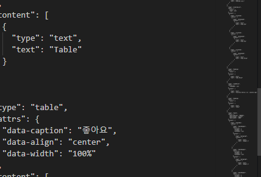

:sectnums:
:sectnumlevels: 4

== Sample Structured Document

This is a sample document to test the Structured Doc Editor. It includes various formatting options.

=== Text Formatting

You can use *bold*, _italic_, and [.underline]#underline# formatting.

=== Lists

Bullet list:

* First item
* Second item
* Third item

Ordered list:

. Step one
. Step two
. Step three
. 오

=== Code Block

[source]
----
function hello() {
  console.log('Hello, world!');
}
----

=== Table

.좋아요
[header,align="center"]
|===
| Header 1 | Header 2 | Header 3
| Cell 1 | Cell 24123 | Cell 3
| Cell 4 | Cell 5 | Cell 623
|===

=== Image

